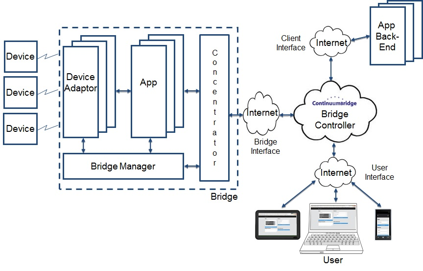

# Platform Overview
ContinuumBridge provides a platform for connecting devices to the Internet, managing them and making it easy for anyone to write applications that use them. The platform consists of local bridges, which currently consist of the ContinuumBridge cbridge software running on Raspberry Pies, and the Bridge Controller, which provides links to a user web portal and application back-ends. This is illustrated below.

Devices are connected to the bridge by wired and wireless protocols. The protocols currently supported are Z-wave, Bluetooth LE (AKA Bluetooth Smart) and USB. Every device is connected to a unique device adaptor. Device adaptors present a common API to apps. For example, a sensor that measures temperature will always appear the same to an app, regardless of who has manufactured the sensor and what protocol has been used to connect it to the bridge. 

The device adaptors that are visible to a particular app are determined by the permissions that a user has given. For example, an app may be registered as being able to use temperature as an input. A given bridge may be connected to five or six devices that can provide temperature, but if the user has chosen to connect just one of these to the app then it will only be able to see that one.

As well as being connected to adaptors, an app is connected to the bridge manager and the concentrator, both other elements on the bridge. The bridge manager provides the app with configuration information and the app can send it information about its state (stopped, starting, running, error), in addition to other status information. The concentrator sends information to the bridge controller, which resides on a cloud server, where it can be routed to a service provider's back-end application via the ContinuumBridge client interface. Data from a client back-end is similarly routed back to the app on the bridge. The routing of messages through the concentrator provides a common security framework, so that an app developer can focus entirely on the application in hand rather than having to consider security as well. 

For the current release, the only bridge platform supported is the Raspberry Pi. In the rest of this documentation, the word “bridge” is used to refer to ContinuumBridge software (cbridge) running on a Rasperry Pi.

[Next page ...](doc:writing-a-bridge-app-on-a-raspberry-pi)
